# 玩转算法

# 导论

## 回答算法问题的思路

不仅仅是解决问题，还可以结合问题背景与应用场景来作答：

### 技术面的非算法问题

## 算法复杂度分析

### 算法面试的准备思路

一些暗示：

- 设计一个O（nlogn）的算法，可能涉及到二叉树搜索
- 无需考虑额外的空间，可考虑用空间换时间
- 数据规模大概为10000，可考虑O（n^2）的算法
- 给定一个有序数组

#### 课后作业：26,27,80题

## 数组问题

### 75 Sort Colors 

元素中取值仅有有限种，可使用计数排序算法：

先统计各种元素的个数，再分别放回原数组。

#### 课后作业 88 Merge Sort Array

#### ？？？？？？？？？？

#### 课后作业： Kth Largest Element in an Array

#### 167 Two Sum II -Input array is sorted

**对撞指针(双索引技术)**：利用i，j两个指针相向而行，

- 当nums[i]+nums[j]==target,返回i,j;
- 当nums[i]+nums[j]<target,i++;
- 当nums[i]+nums[j]>target,j--;

#### 125 Valid PalIdRome  回文串

给定一个字符串，只看其中的数字和字母，忽略大小写，判断这个字符串是否为回文串？

- 空字符串如何看
- 字符的定义？
- 大小写问题

#### 344 Reverse String

给定一个字符串，返回这个字符串的倒序字符串

#### 需要跳过非数字字母的字符，例如、，空格等！用库函数return false;!Character.isLetterOrDigit(s.charAt(i))进行验证

—如，“hello” ，返回“olleh"

#### 345 Reverse Vowels of a String 

—如：给出“hello”，返回“holle”

—元音不包括y

#### 11 Container With Most Water

给出一个非负整数数组 a1,a2,a3,...,an,每一个整数表示一个竖立在坐标轴X位置的一堵高度为ai的墙，请选择两堵墙，和x轴构成的容器可以容纳最多的水。  

#### 209 Minimum Size Sub array Sum

遍历所有子数组，求其sum和，复杂度为O(n^3)。但可通过优化优化为O(n^2)

**滑动窗口解决该问题：设立索引i，j，当i，j之间的子数组和小于target，则增加j，直到其大于target，当大于target后，不断增加i的值，缩小子数组的长度。直到和小于target**

nums[l..r]为滑动窗口，初始时滑动窗口应为空，故l=0,r=-1;

#### 3 Longest Substring Without Repeating Characters

-如“abcabcbb”，则结果为“abc"

-字符集？只有字母？数字+字母？ASCII？

-大小写是否敏感？

#### 438 Find All Anagrams in a String

Anagrams:只需包含的字符相同即可，顺序任意。

#### 76 Minimum Window Substring

## 查找表问题

查找有无

- 元素‘a’是否存在？**set：集合**

查找对应关系（键值对应）

- 元素‘a’出现了几次？**map：字典**

#### 349 Intersection of two Arrays

思路：**判断一组中元素是否存在在第二组中，与次数无关，使用set**

将nums1中元素均加入set中，再将nums2中元素依次判定是否在set中。

#### 350 Intersection of Two Arrays

思路：**判断两组数组的交集，与次数有关，使用map**

**对于不同的Set，Map底层实现方式，不同操作所需要的时间复杂度不尽相同。**

**对于查找来说，哈希表是一种非常优秀的数据结构，插入查找删除操作的平均时间复杂度均O(1)。**

**但其也存在缺点：失去了数据的顺序性**

导致许多操作不便：

- 求数据集中最大最小值
- 某元素的前驱后继
- 某元素的排位rank

#### 思考题：查找公共元素一题是否可只使用一个set来完成？

 

#### **课后题：以下问题均可使用set，map两种数据结构来解决**

**a-dog,b-cat,abba-dog cat cat dog**

#### 思考题：怎样使用排序+双索引对撞来获得正确的索引（索引会随排序变化）

由于查找表也需要存储元素对应的索引，所以必须得使用**HashMap**数据结构来存键值对

**一次把所有的数组元素值放入Map中可能会导致覆盖相同的元素，而查找可能会出错，比如84=42+42，覆盖后只存在一个42，找不到结果。故而下图方法应该改为**

每次查找表中只放入当前元素v之前的元素，在将v放入查找表之前进行互补元素的查找find，若不存在，继续将v放入查找表，这样的话即使放入了重复值，也不会影响结果。

#### 课后题

#### 思考：该使用Map 还是 Set？

#### 课后题：

**思考本题键值究竟要存放什么是关键**

#### 讲解题：

**由于点i为枢纽，故计算点j,k与点i的距离，将距离相同的点分组累加**

**易错点1：这里的distance为了避免浮点数带来的误差，选择将距离直接计算为平方和不开根号**

**易错点2：求distance时两个平方和的相加可能产生整型越界问题，应考虑好值的大小**

**貌似是三元组的问题，但仅涉及到两重遍历**

#### 课后题：

#### 讲解题：

**暴力解法：O(n^2)**

**滑动窗口解法：在k+1长度的区间中能不能找到两个元素相等？**

**向右滑动 时，看右端点是否在窗口类与之相同的元素，有没有，Set**

#### 练习题

#### 讲解题

- **v-t<v<v+t   区间查询**
- C++ record.lower_bound(nums[i]-t)，寻找大于等于nums[i]-t的最小的值 
-  **LeetCode提交可能会出现整型溢出**

## 链表问题

#### 206 Reverse Linked List

**反转一个链表**：**反转指针而不是更改元素值，才符合算法规范**

**反转：先保存next节点，再断开连接，头指针指向空。还需要一个指向前一个节点的指针**

1. cur>next=pre
2. pre=cur
3. cur=next
4. next=next>next
5. 循环直到cur指针为null

#### 练习题：92 Reverse LInked LIst II

#### 如何测试自己的链表程序

- 创建链表函数
- 打印链表信息函数
- 使用链表类

 

#### 练习题： 83 Remove Duplicates from Sorted List

#### 练习题： 86 Partition List

#### 练习题： 328 Odd Even Linked List

#### 练习题： 2 Add Two Numbers

#### 练习题： 445 Add Two Numbers II

### 链表相关算法的必备操作

#### 203 Remove Linked List Elements

#### 练习题： 82 Duplicates from Sorted List II

#### 练习题： 21 Merge Two Sorted Lists

#### 24 Swap Nodes in Pairs

#### 24 Reverse Nodes in k-Groups

#### 147 Insertion Sort List

#### 148 Sort List

**提示：自顶向上的归并排序不需要在下表的随机索引**

### 链表不仅仅是穿针引线

#### 237 Delete Node in a Linked List

#### 19 Remove Nth Node From End Of List

- 解法1：先遍历一遍计算链表长度，再遍历一遍删除倒数第n个节点
- 解法2：有没有可能只遍历一遍链表？
  - 使用双指针，p指针初始指向虚拟头结点，q与p间隔N个节点。两指针一起移动，保持间隔距离，直到q指针指向空，则删除p的下一个节点。

#### 练习题 61 Rotate List

#### 练习题 143 Recorder List

#### 

**提示：一次遍历先找中间元素，将链表分为两个，右边链表进行Reverse操作，之后左右链表进行合并**

#### 练习题 234 Palindrome Linked List

## 栈、队列、优先队列

### 栈的基础使用

#### 20 Valid Parentheses

**栈顶元素反映了在嵌套的层次关系中，最近的需要匹配的元素**

#### 练习题 150 Reverse Polish Notation

#### 练习题 71 Simplify Path

### 栈和递归的紧密关系

#### 二叉树的三种遍历

#### 144 Binary Tree Preorder Traversal

#### 练习题 341 Flatten Nested List Iterator

在hasNext为true的情况下，不断调用next（），依次获得1 4 6

### 队列Queue——基本应用广度优先遍历

广度优先遍历：

- 树；层序遍历
- 图；无权图的最短路径

#### 102 Binary Tree Level Order Traversal

#### 练习题 107 Binary Tree Level Order Traversal II

#### 练习题 103 Binary Tree Zigzag Level Order Traversal 

#### 练习题 199 Binary Tree Right Side View 

### BFS和图的最短路径

#### 279 Perfect Squares

**贪心算法在该例中是不成立的！！！**

**转化为图论的问题**

**找4,5,6这些数到0的最短路径**

## 二叉树和递归

## 递归和回溯法

## 动态规划

### 斐波那契数列

**斐波那契数列根据递归来计算的时候，其时间复杂度是指数级的**

#### 自上而下与自下而上

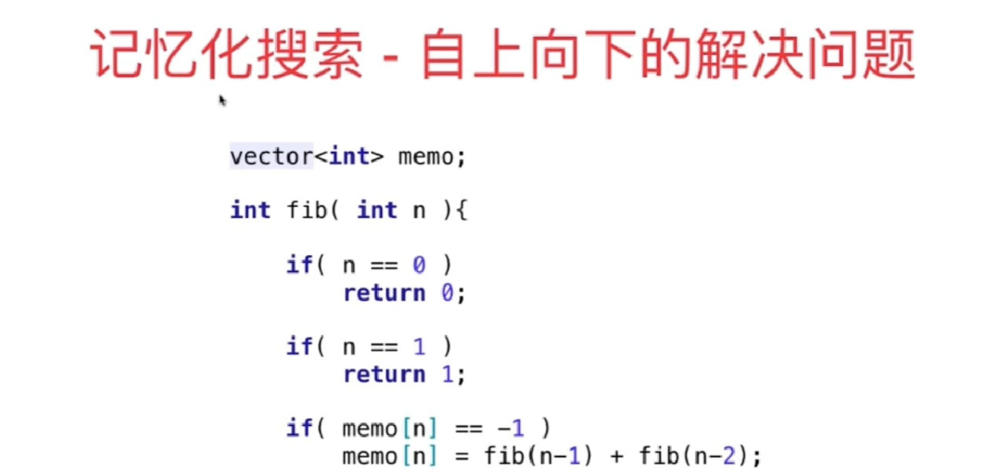

**先解决小数据量时的结果，再解决更大数据量情况下的结果，此过程即被称为动态规划**

#### 动态规划：将原问题拆解为若干子问题，同时保存子问题的答案，使得每个子问题只求解一次，最终获得原问题的答案。

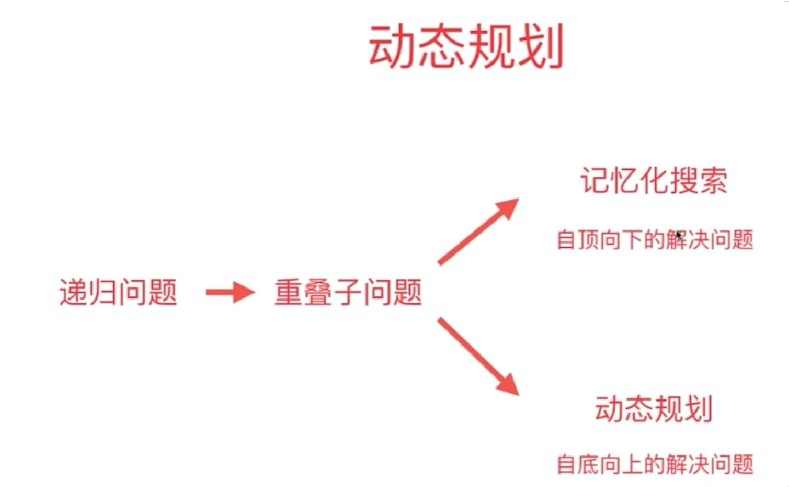

#### 70 Climbing Stairs 

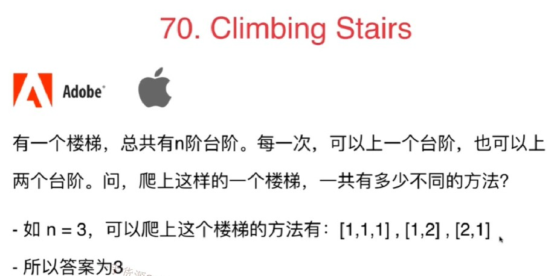

#### 练习题 120 Triangle

**提示：先使用递归的方式求解，再考虑如何使用记忆化搜索与动态规划方式求解**

#### 练习题 64 Minimum Path Sum

**思考限定：非定整数与只能左移或下移对于题目有何意义？没有会有什么影响？**

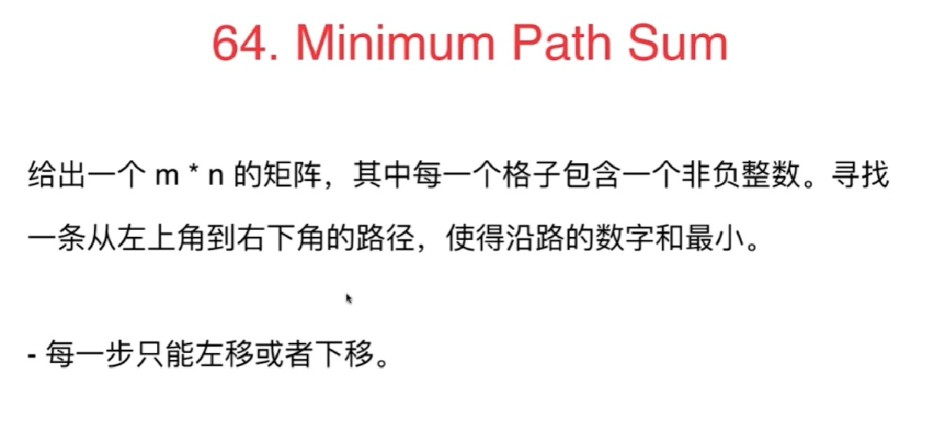

### 343 Integer Break

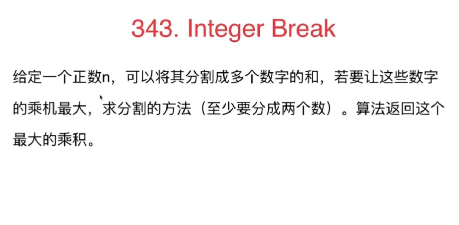

暴力解法：回溯遍历将一个数做分割的可能性枚举：O(2^n)

### 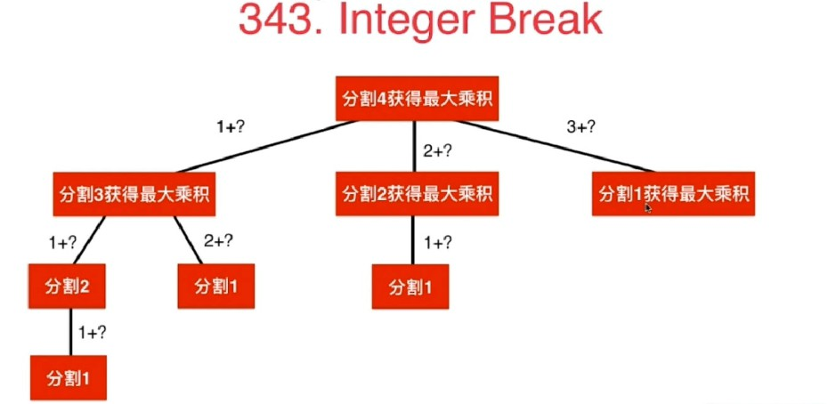

#### 练习题 279 Perfect Squares

用动态规划代替图的方法来解决

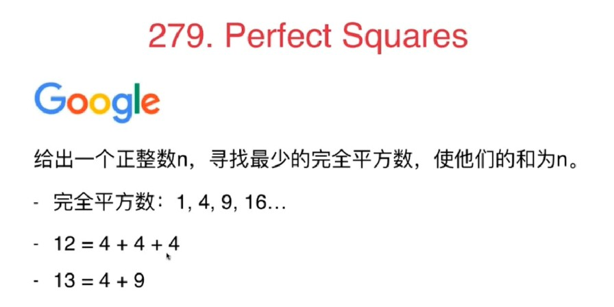

#### 练习题 91 Decode Ways

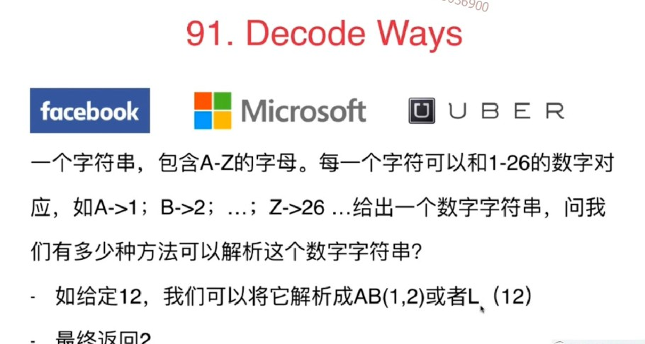

#### 练习题 62 Unique Paths

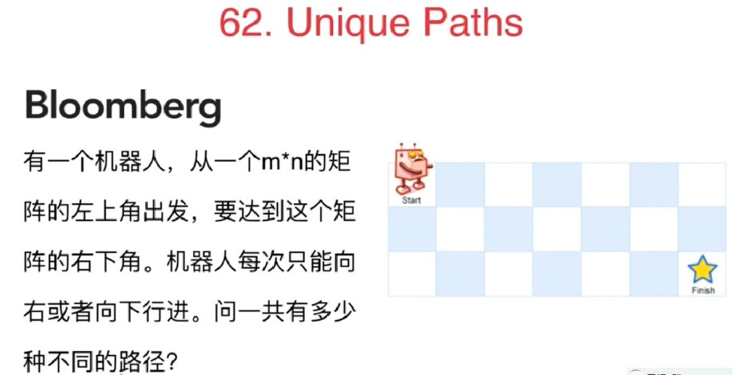

#### 练习题 63 Unique Paths II

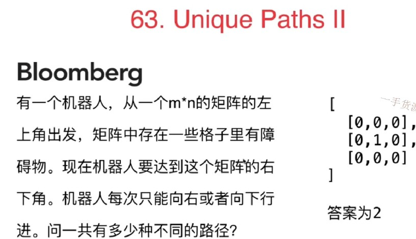

#### 

#### 198 House Robber

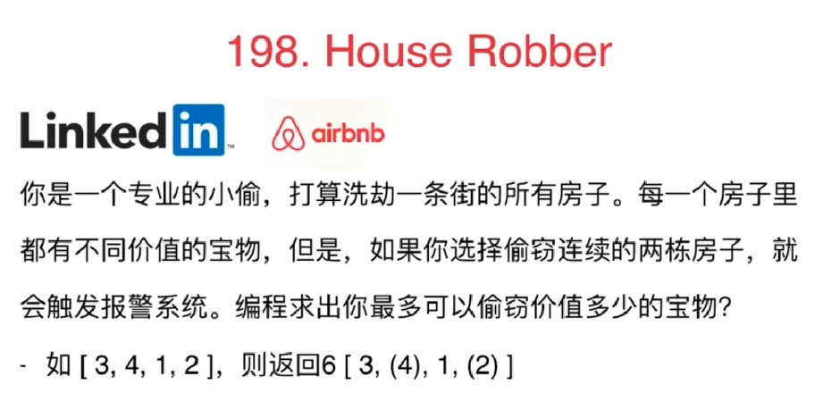

**暴力解法：检查所有房子的组合，每个组合检查是否有相邻房子，如果没有，记录其价值。找最大值。O((2^n)*n)**

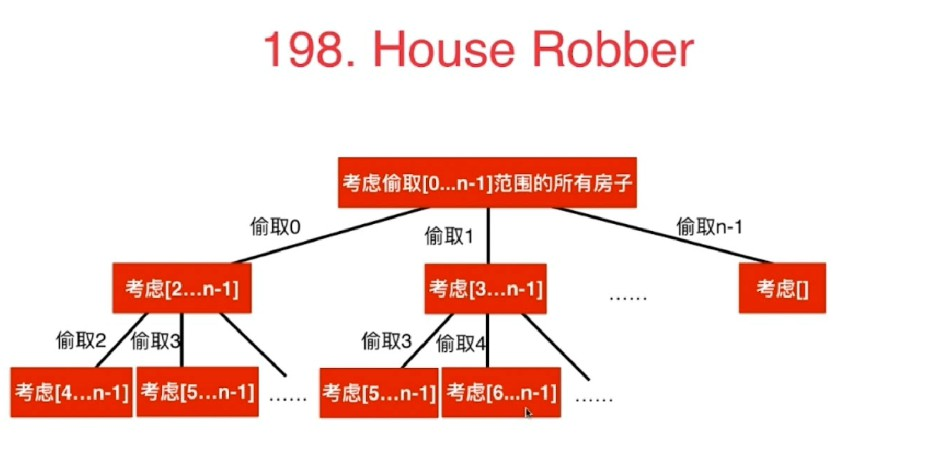

#### 动态规划中重要的概念：状态

**考虑**偷取[x...n-1]范围内的房子**（状态定义了函数要做什么，函数的定义）**

根据对状态的定义，**决定状态的转移，定义了函数怎么做：**

f(0)=[0...n-1]范围内的房子

f(0)=max{v(0)+f(2),v(1)+f(3),v(2)+f(4),...,v(n-3)+f(n-1),v(n-2),v(n-1)}**(状态转移方程)**

